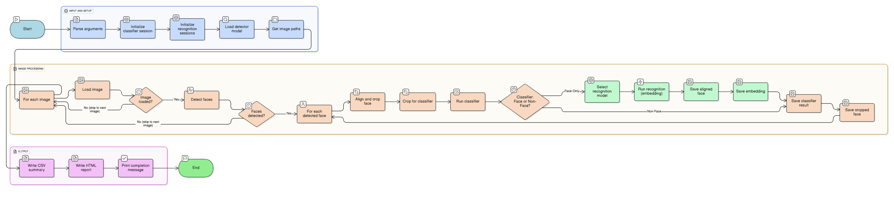

# faceflow

This repository provides a complete end-to-end face recognition pipeline, including face detection, cropping, alignment, and recognition. It takes raw images as input, automatically detects and aligns faces for consistency, and outputs embeddings for recognition tasks such as verification, identification, or clustering.

---

## 📂 Project Structure

```
|   main_multi_with_classifier.py # Entry point for running the pipeline
|   utils.py                      # Helper utilities
|   production_alignAndCrop.py    # Production alignment & cropping (used for classifier)
|   face_detection_and_alignment.py # Face detection and alignment script
|   config.yaml                     # Config file for face_detection_and_alignment script
|
+---insightface
|   |   alignface.py         # Face alignment functions
|   |   common.py            # Common utilities
|   |   face_analysis.py     # Face detection & analysis
|   |   retinaface.py        # RetinaFace detector wrapper
|
+---models
|       buffalo_detector.onnx                                                        # Buffalo-based face detector
|       retinaface_detector.onnx                                                     # RetinaFace detector
|       clear_face_recognition_model.onnx                                            # Recognition model for clear faces
|       masked_face_recognition_model.onnx                                           # Recognition model for masked faces
|       mask_classifier_with_face_branch_with_extra_convLayer_BGR_chk51_epoch3.onnx  # Classifier model
|
+---sample_image
|       132708392331985247.png   # Example input image
|       0_Parade_Parade_0_178.jpg
```

---

## 🚀 How to Run

### 1. Run Full Pipeline (Detection → Alignment → Classification → Recognition)



```bash
python main_multi_with_classifier.py --input_dir sample_image/ --output_dir sample_image_retinaface --detector retinaface
```

This will:

* Detect and align faces
* Classify images as ClearFace / MaskedFace
* Automatically choose the right recognition model
* Generate **512-dimensional embeddings**

**Arguments:**

* `--input_dir` → Path to the input directory
* `--output_dir` → Path to the output directory
* `--detector` → Detector to use (`retinaface` or `buffalo`)

---

### 2. Run Only Face Detection & Alignment


You can also run just the **face detection and alignment** step using `face_detection_and_alignment.py`.
This script uses the **config.yaml** file for input parameters.

#### Example `config.yaml`

```yaml
image_path: "sample_image/132708392331985247.png"  # Path to input image
detector: "retinaface"                             # Options: retinaface | buffalo
device: "cuda"                                     # Options: cuda | cpu
```

#### Run the script:

```bash
python face_detection_and_alignment.py
```

This will:

* Load the specified image
* Run detection with the chosen detector
* Perform alignment
* Save the detected as well as aligned face(s)

---

## 🧩 Features

* Face detection with **RetinaFace** & **Buffalo**
* Face alignment for better recognition
* Classification of images into **Face / Non-Face / Mask**
* Recognition using **ClearFace** & **MaskedFace** models

